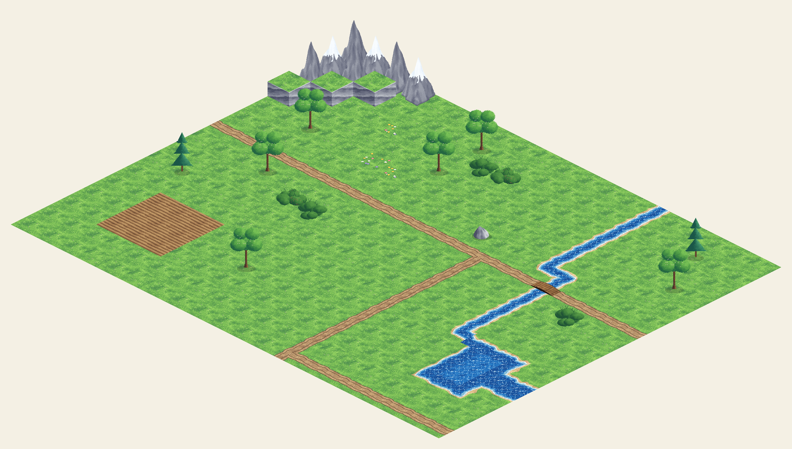

# Terrain-Tileset — Anleitung

Isometrisches HD-Pixel-Art-Tileset für den Map-Bau in Godot 4 (TileMapLayer).



---

## Dateien

| Datei | Inhalt |
|-------|--------|
| `assets/tiles/terrain_ground.png` | Boden-Atlas: Gras, Blumen, Sand, Erde, Acker, Fluss, Straße, See, Brücke, Furt (Zellen 128×64) |
| `assets/tiles/terrain_tall.png` | Hohe Tiles: Berge, Klippe, Findling, Gestrüpp, Bäume (Zellen 128×192) |
| `assets/tiles/terrain_tileset.tres` | Fertige Godot-TileSet-Ressource (beide Atlanten + Custom-Data) |
| `scripts/tile_ids.gd` | `TileIds`-Konstanten: Atlas-Koordinaten aller Tiles |
| `scenes/map_demo.tscn` | Demo-Szene mit Beispielkarte (Referenz für die Tile-Auswahl) |
| `tools/generate_tileset.py` | Generator — erzeugt Atlanten, `.tres` und `tile_ids.gd` neu |
| `tools/render_preview.py` | Rendert `docs/preview_map.png` aus den Atlanten |

## Technische Eckdaten

- **Tile-Größe:** 128×64 px (2:1-Iso-Raute), logisch 64×32 mit 2× Nearest-Upscale („HD Pixel Art“)
- **Hohe Tiles:** 128×192 px, `texture_origin = (0, 64)` → Rautenbasis sitzt auf dem Grid (2,5D-Illusion)
- **TileSet:** `tile_shape = Isometric`, `tile_layout = Diamond Down` → quadratische Grid-Logik (Manhattan-Distanz!), isometrisch dargestellt
- **Texturfilter:** Projekt steht auf `Nearest` (Pixel bleiben scharf)

## Grid-Orientierung

Godot-Grid-Achsen bei *Diamond Down*: **+x = unten rechts, +y = unten links.**
Die Himmelsrichtungen im Tileset beziehen sich auf das Grid:

```
        N (-y)                 Bildschirm:
   W          E                    N = Kante oben rechts
     (Raute)                       E = Kante unten rechts
   (-x)      (+x)                  S = Kante unten links
        S (+y)                     W = Kante oben links
```

## Fluss & Straße: Verbindungsmasken

Fluss- und Straßen-Tiles liegen als komplette 16er-Familie vor —
Index = Bitmaske der verbundenen Nachbarn: **N=1, E=2, S=4, W=8**.

```gdscript
# Beispiel: Fluss-Tile, das Nord und Süd verbindet (gerades Stück):
ground.set_cell(pos, TileIds.GROUND_SRC, TileIds.RIVER[1 | 4])
# Straßen-Kreuzung:
ground.set_cell(pos, TileIds.GROUND_SRC, TileIds.ROAD[15])
```

Maske 0 = Einzeltile (Tümpel bzw. Erdfleck). Die Auswahl per Nachbarschafts-Scan
zeigt `scenes/map_demo.gd` (`_conn_mask`).

## See-Ufer

Für große Wasserflächen gibt es Übergangs-Tiles mit Sandufer + Schaumsaum.
Benennung nach der **Gras-Seite**:

- `LAKE_EDGE_N/E/S/W` — gerade Uferkante (Gras auf der genannten Seite)
- `LAKE_OUT_NE/SE/SW/NW` — Außenecke (Gras auf zwei Seiten)
- `LAKE_IN_NE/SE/SW/NW` — Innenecke (Gras nur im Eck)
- `WATER_FULL`, `WATER_DEEP` — offenes/tiefes Wasser
- `WATER_LILY`, `WATER_ROCKS` — Deko-Varianten (Seerosen, Felsen im Wasser)

Auswahl-Logik: `scenes/map_demo.gd` (`_lake_tile`).

## Flussquerungen

- `BRIDGE_EW` / `BRIDGE_NS` — Holzbrücke (Deck E–W bzw. N–S, Wasser quer dazu); `terrain = "bridge"`, begehbar, Kosten 1
- `FORD_EW` / `FORD_NS` — Furt mit Trittsteinen im Flachwasser; `terrain = "ford"`, begehbar, Kosten 2 (taktisch interessant: langsamer als die Brücke)

Die Benennung gibt die **Weg-Richtung** an. In `map_demo.gd` steht `=` für eine E–W-Brücke.

## Custom-Data (fürs Taktik-Grid)

Jedes Tile trägt sieben Custom-Data-Felder. `terrain` bleibt das Optik-/Debug-Tag,
`field_type` ist die **Funktions-Kategorie** (GDD §5.1 „Gelände-/Feld-Funktionstypen"):

| Feld | Typ | Bedeutung |
|------|-----|-----------|
| `terrain` | String | Optik-Tag: `grass`, `water`, `road`, `bridge`, `ford`, `sand`, `dirt`, `brush`, `mountain`, `cliff`, `tree`, `boulder` |
| `move_cost` | **float** | Bewegungskosten ins MOB-Budget: Pfad `0.5`, Boden `1.0`, Dickicht `1.5`, unbegehbar `0.0` |
| `walkable` | bool | Wasser, Berge, Bäume, Findlinge = `false` |
| `field_type` | String | Funktionstyp: `boden` · `dickicht` · `pfad` · `fluss` · `barriere` · `blockade` · `effekt` · `deckung` |
| `conceals` | bool | `true` → Einheit darauf wird „Scheinbar" (Deckung, §5.2) |
| `destructible` | bool | `true` → zerstörbare Blockade (wird nach Zerstörung zu `boden`) |
| `hp` | int | LP der Blockade (0 = n/a) |

```gdscript
var data := ground.get_cell_tile_data(pos)
if data and data.get_custom_data("walkable"):
    var cost: float = data.get_custom_data("move_cost")  # jetzt float!
    var ftype: String = data.get_custom_data("field_type")
```

**Pro-Zelle statt pro-Tile:** `flow_dir` (Fließrichtung eines Fluss-Feldes) und
`effect_id` (welches Endlos-Event §9.6 / welchen Feld-Statuseffekt §5.2 ein Effekt-Feld
auslöst) hängen von der **Platzierung** ab, nicht vom Atlas-Tile — sie liegen deshalb in
den **Map-/Chunk-Daten**, nicht in dieser Custom-Data-Tabelle.

**Noch ohne eigene Optik (Tileset v1):** `blockade`, `effekt` und `deckung` haben noch
keine eigene Kachel — das Custom-Data-**Schema** steht bereits, die Painter/Atlas-Slots
folgen (dann tragen die neuen Tiles `field_type`/`conceals`/`destructible`/`hp` direkt).

## Maps bauen (Editor-Workflow)

1. Neue Szene → `TileMapLayer`-Node anlegen, `terrain_tileset.tres` als *Tile Set* zuweisen
2. Zweite `TileMapLayer` für Props (Bäume, Findlinge) darüber, **Y Sort Enabled** aktivieren
3. Im TileMap-Panel unten Tiles auswählen und malen
4. Berge/Klippen/Gestrüpp haben eine eingebaute Grasbasis → direkt auf die Ground-Layer
5. Bäume/Findlinge sind freigestellt (transparent) → auf die Props-Layer über beliebigen Boden

## Tileset neu generieren

```bash
pip install pillow
python3 tools/generate_tileset.py   # Atlanten + .tres + tile_ids.gd
python3 tools/render_preview.py     # docs/preview_map.png
```

Paletten, Tile-Layout und alle Parameter liegen oben in `tools/generate_tileset.py`.
`SEED` ändern ⇒ neue Varianten derselben Tiles.

## Ideen für den Ausbau

- Wasserfall-Tile an Klippenkanten, Fluss mit Gefällestufe
- Schnee-/Winter-Biom (Paletten-Swap ist im Generator trivial)
- Klippen-Varianten für alle vier Richtungen + Rampen/Treppen (Höhenstufen fürs Taktik-Grid)
- Animiertes Wasser (2–4 Frames, Godot-Atlas-Animation)
- Gebäude-Tiles für Bergheim (Hütten, Schmiede, Palisade)
